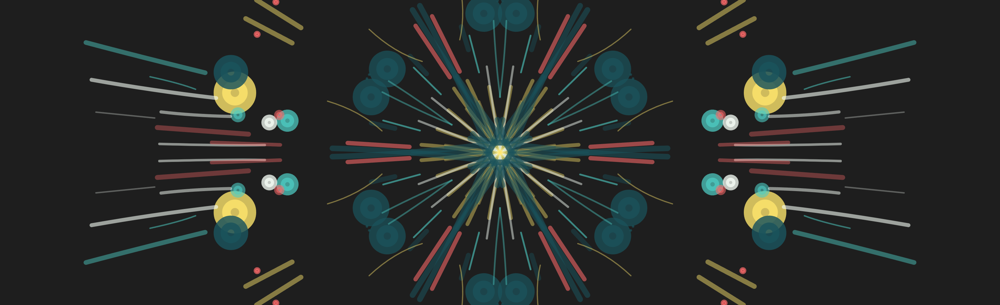

# Bismaya Kaleidoscope Pro

An interactive digital kaleidoscope art tool for generating stunning symmetrical designs right in your browser.

## 🚀 Live Demo  
👉 [Try it online](https://dukebismaya.github.io/kaleidoscope-app/)

## ✨ Features
- Multiple symmetry modes (1x–12x)
- Line, curve, and circle tools
- Predefined, random, and custom colors
- Adjustable brush size
- Dark/light mode toggle
- Rotation animation
- One-click random art generation
- Layer system with opacity control
- Undo/redo functionality with keyboard shortcuts
- Save as PNG
- Responsive & smooth performance

## 🖱️ Usage
Just open the HTML file in any modern browser — no installation needed.

### Keyboard Shortcuts
- **Ctrl+Z**: Undo
- **Ctrl+Y** or **Ctrl+Shift+Z**: Redo

### Layer System
- Create up to 5 layers for complex compositions
- Adjust opacity for each layer individually
- Toggle layer visibility
- Undo/redo tracks layer changes

## 🔧 Built With
- HTML5, CSS3, JavaScript
- [p5.js](https://p5js.org/)

## 📌 Roadmap
- More brushes & shapes  
- SVG export  
- Gallery support  

## 🧑‍🎨 Author
Made with ♥ by [Bismaya Jyoti Dalei](https://github.com/dukebismaya)

## 📄 License
MIT License. See the [LICENSE](LICENSE) file.

## 📂 Repo
[github.com/dukebismaya/kaleidoscope-app](https://github.com/dukebismaya/kaleidoscope-app)
